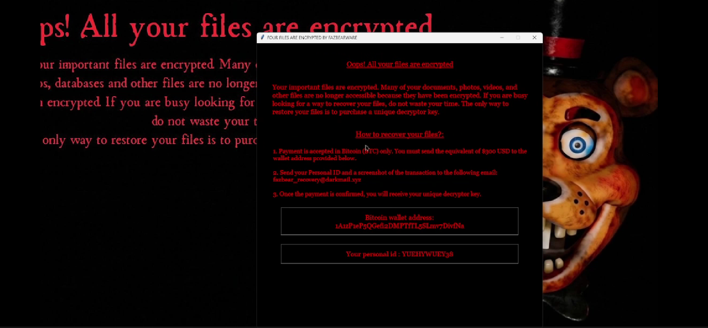

# Fazbearware

⚠️ Disclaimer
This project is for educational and research purposes only. It is designed to be executed in controlled virtual environments (Sandbox/VMs) to understand malware mechanics.

FazbearWare is a functional malware Proof-of-Concept (PoC) designed for cybersecurity research. It simulates a  ransomware attack cycle within controlled environments.
-Scans and encrypts files using the Fernet (AES-128) symmetric algorithm.
-Automatically changes the desktop wallpaper and triggers persistent background audio via Windows API.
-Generates a unique 55-character ID for each infected machine to manage decryption keys.
-Deploys a custom UI with automated payment instructions and contact details for the attacker.
-Automated exfiltration of encryption keys to a remote Flask-based Command & Control server.

